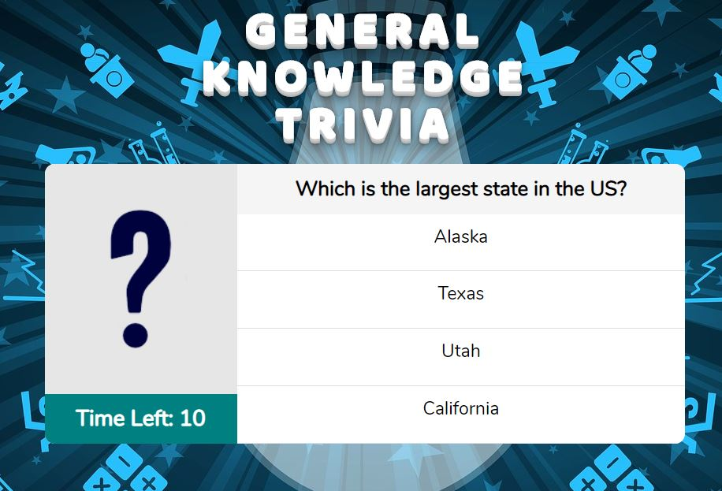

# General Knowledge Trivia

## Game Overview

- This trivia game shows only one question until the player answers it or their time runs out.

- If the player selects the correct answer, a check mark shows up next to the correct answer. After a few seconds, the next question is display.

- If the player runs out of time, the correct answer is display, then wait a few seconds to show the next question.

- If the player chooses the wrong answer, an X mark shows up next the wrong answer and the correct answer is display. After a few seconds, the next question is display.

- On the final screen, a result with the number of correct answers and incorrect answers is display. After closing the results screen, the player can press the start button and play again.

## Screenshot

