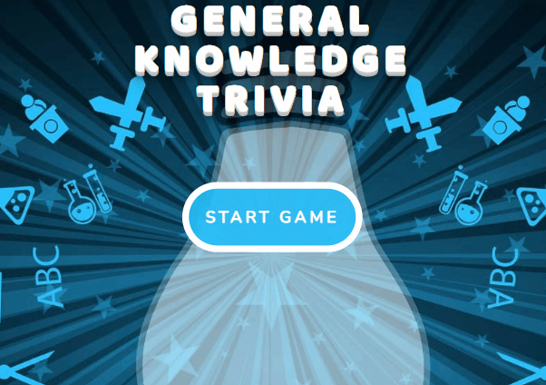

<h1 align="center">Game of General Trivia 📚</h1>

  

> This is a simple game of general trivia build with jQuery.

### ✨ [Demo](https://galoelmer.github.io/TriviaGame/)

## Game Overview

- This trivia game shows only one question until the player answers it or their time runs out.

- If the player selects the correct answer, a check mark shows up next to the correct answer. After a few seconds, the next question is display.

- If the player runs out of time, the correct answer is display, then wait a few seconds to show the next question.

- If the player chooses the wrong answer, an X mark shows up next the wrong answer and the correct answer is display. After a few seconds, the next question is display.

- On the final screen, a result with the number of correct answers and incorrect answers is display. After closing the results screen, the player can press the start button and play again.

## Screenshot

  

## Built With

* [jQuery](https://jquery.com/) - Fast, small, and feature-rich JavaScript library

## Author

👤 **Noah Galo**

* Github: [@galonoah](https://github.com/galonoah)

## 🤝 Contributing

Contributions, issues and feature requests are welcome!

## Show your support

Give a ⭐️ if this project helped you!

## 📝 License

Copyright © 2024 [Noah Galo](https://github.com/galonoah). 
This project is [MIT](https://github.com/kefranabg/readme-md-generator/blob/master/LICENSE) licensed.

